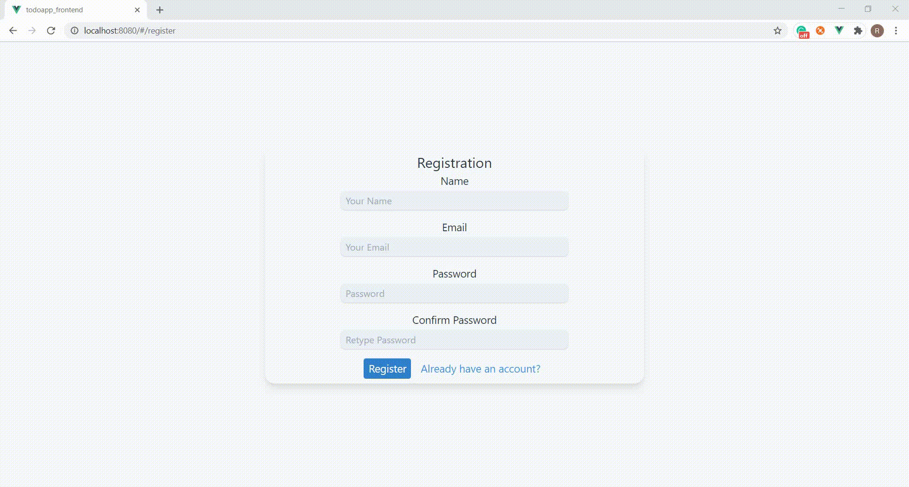
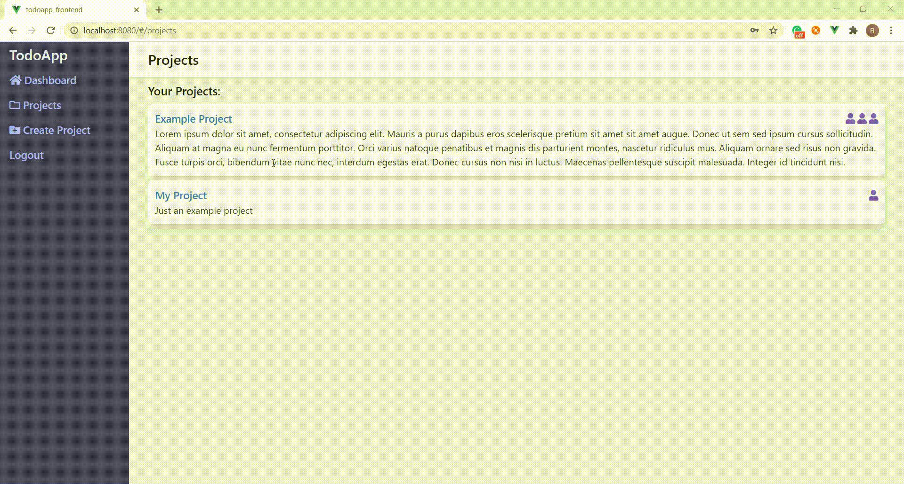
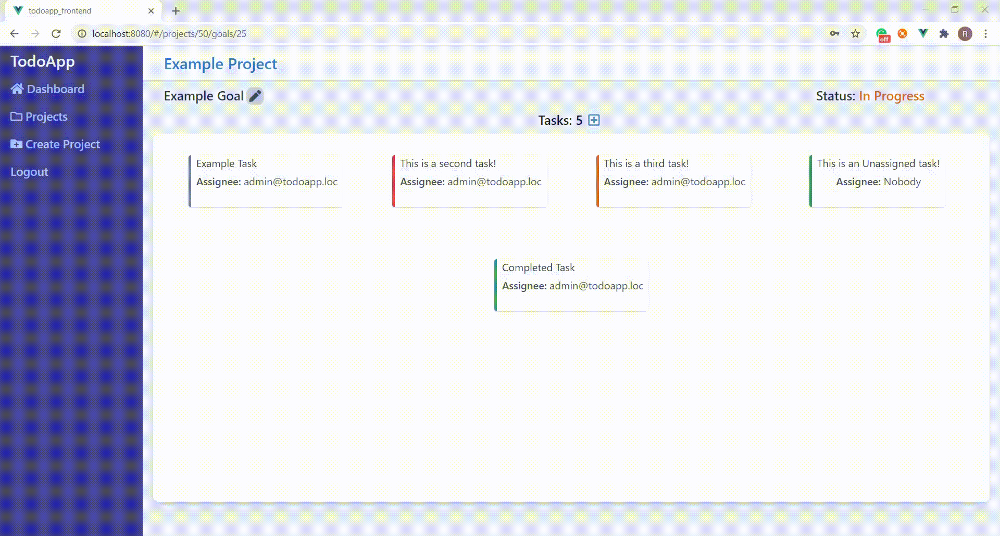
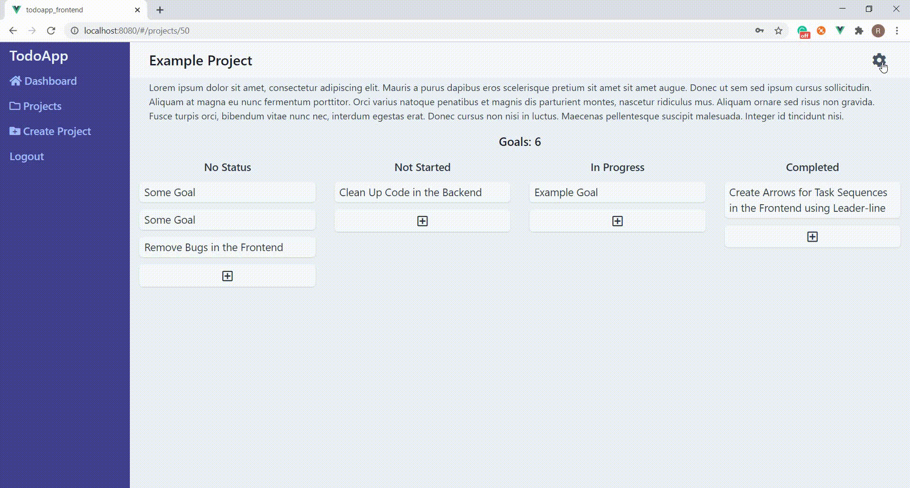
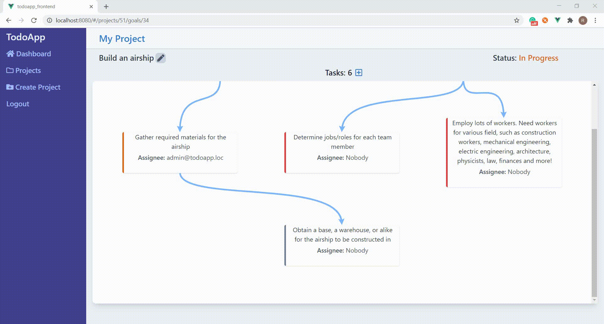
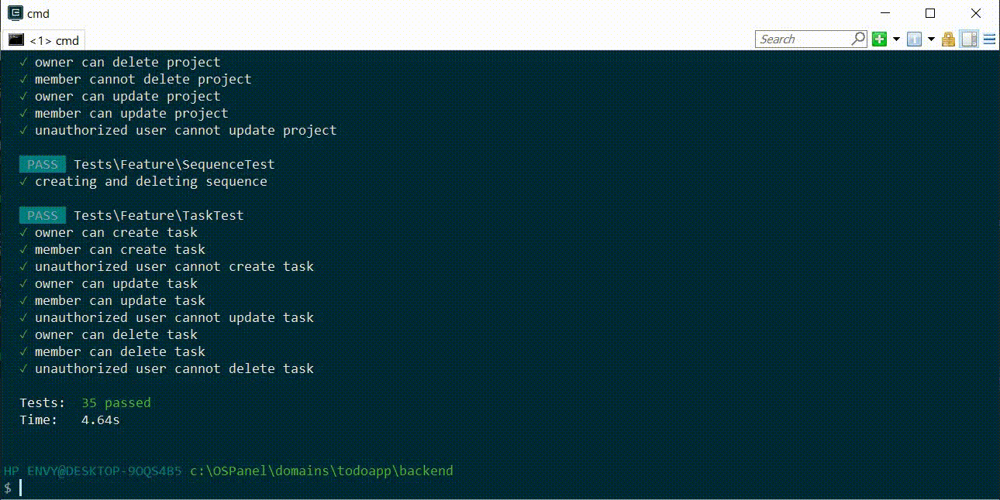

# Project Planner
This is a project planner web application I've been working on. It's dependent on two separate servers that interact with each other.

The backend uses the PHP framework **Laravel** and it runs on this domain: "todoapp.loc/"

The frontend uses the **VueJS** framework and it runs on "localhost:8080/"

It's a basic project planner application that can be used for managing multiple projects. It includes the key features of any other project planner application, such as authentication, project management, team management, security/privacy, and project-related tasks management.

- Built in Laravel 8
- Built in Vue 2
- Uses [Tailwind CSS](https://tailwindcss.com/)
- Uses [jwt-auth](https://jwt-auth.readthedocs.io/en/develop/)
- Uses [leader-line](https://anseki.github.io/leader-line/)

## Authentication

The app includes an authentication system. JWT-Auth allows for a secure authentication and interaction between the frontend and the backend. Tokens have an expiration time of 2 hours. Once the expiration time is over, the token will be invalid, any action with that token will be denied and the user will be automatically signed out.

## Project Management

Users can create multiple projects, in which they can work individually or in a team. Projects can have a title and a description on them, but by default they are "Untitled" and "No description" relatively.

Users can create goals related to the project, and assign one of the following statuses: "No status", "Not Started", "In progress", and "Completed". A goal can be updated, whether to change its title or status.

Each goal can have a series of tasks needed to achieve that said goal. Similar to goals, tasks also have the four possible statuses. Tasks can also be updated or deleted. The status of each task can be identified by the colors on the side of the task card. Colors green, orange, red, and gray representing "Completed", "In Progress", "Not Started", and "No Status" statuses relatively.

## Team Management

The creator of the project is automatically assigned the role of the leader. The role of the leader will remain with the creator and it cannot be transferred. Belows are the abilities of a leader and the team members:

Leader:
1) Can update Project title or description
2) Can delete the project (removing all the members in the process).
3) Can create tasks, update them, or delete them.
4) Can view the list of members in the project, and modify it by adding or removing members.

Team member:
1) Can update Project title or description
2) Can create tasks, update them, or delete them.
3) Can view the list of members in the project (Only view!)

The leaders and the members can assign the task to someone, as long as that someone is in the team! If that person is removed from the team, the tasks assigned to them will change it's assigned user to "Nobody"
In the list of members, the users can tell who the project leader is by looking at the crown that's next to the name of the leader.

## Security/Privacy
After creating a project, only the creator has access to view and modify it. The project is restricted from viewing or modifying for any other person, unless the creator shared the project with them. Removing members from the team restricts them from accessing the project. Only the people that the user chooses can access the user's project.

## Task Sequence

Tasks can have a sequence. A task can have previous tasks that are supposed to be completed beforehand, and next tasks that are to be completed after that task is completed. The arrows created through LeaderLine indicate the next task in the sequence. Tasks can also be detached from the sequence.

As of right now, the page needs to reload to re-organize the tasks positions after a sequence of tasks is changed.

## API testing

The backend holds various API tests for expected behavior. This allows developers to test the API behavior in matter of seconds, instead of manually testing API.
